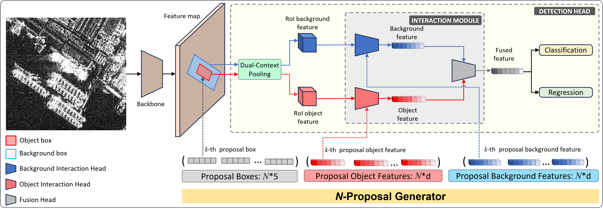
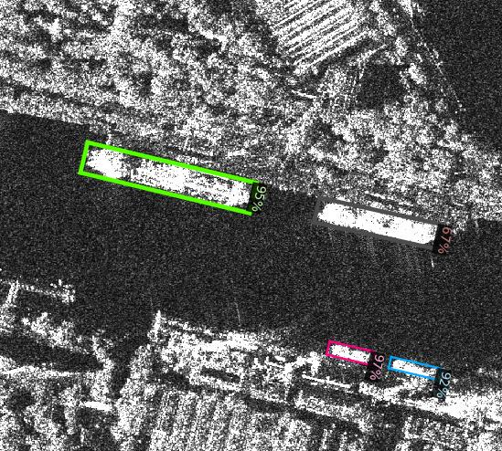
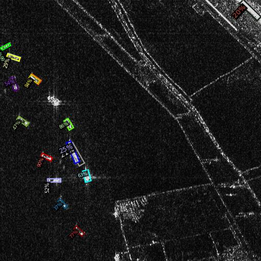

## Sparse R-CNN OBB: Ship Target Detection in SAR Images Based on Oriented Sparse Learnable Proposals
[](https://www.gnu.org/licenses/gpl-3.0)  [](https://doi.org/10.5281/zenodo.15624725) [](https://doi.org/10.5281/zenodo.15624144) [](https://www.arxiv.org/abs/2504.18959) [](https://ieeexplore.ieee.org/document/11027781)


### Publication link: [IEEE J-STARS 2025](https://ieeexplore.ieee.org/document/11027781)

## Built Upon
This codebase is built on top of:

- [Detectron2](https://github.com/facebookresearch/detectron2)
- [DETR](https://github.com/facebookresearch/detr)
- [Sparse R-CNN](https://github.com/PeizeSun/SparseR-CNN) — which serves as our baseline

**R-Sparse R-CNN** is an enhanced version of [Sparse R-CNN OBB](https://github.com/ka-mirul/Sparse-R-CNN-OBB), featuring **Background-Aware Proposals (BAPs)** for improved object detection.

## Installation
#### Requirements
- Linux or macOS with Python ≥ 3.6
- You’ll need PyTorch ≥ 1.5 along with a [torchvision](https://github.com/pytorch/vision/) version that matches your PyTorch installation.  
For best compatibility, install both from [pytorch.org](https://pytorch.org).
- OpenCV is optional and needed by demo and visualization

#### Steps
1. Download \
   Download codes from this repo and pretrained weights here: [zenodo.org/records/15624144 ](https://zenodo.org/records/15624144). \
   These pretrained weights were obtained by separately training on [SSDD](https://github.com/TianwenZhang0825/Official-SSDD) and [RSDD-SAR](https://github.com/makabakasu/RSDD-SAR-OPEN) datasets.
   
1. Create your virtual environment \
   Navigate to codes directory and create virtual environment.
```
python3 -m venv venv
```
  Then, active the virtual environment:

```
source venv/bin/activate
```
2. Install required libraries (see [requirements.txt](./requirements.txt) for details)
```
pip install opencv-python scipy pillow matplotlib pycocotools
```
3. Install Detectron 2
```
pip install -e .
```

4. Demo
```    
python demo/demo.py\
    --config-file projects/RSparseRCNN/configs/rsparsercnn.res50.100pro.yaml \
    --input test_samples/SSDD_test_sample_000229.jpg \
    --output test_samples/demo_output_000229.jpg \
    --confidence-threshold 0.2 \
    --opts MODEL.WEIGHTS saved_models/model_SSDD.pth
```
or

```    
python demo/demo.py\
    --config-file projects/RSparseRCNN/configs/rsparsercnn.res50.100pro.yaml \
    --input test_samples//RSDD_test_sample_103_18_37.jpg \
    --output test_samples/demo_output_103_18_37.jpg \
    --confidence-threshold 0.2 \
    --opts MODEL.WEIGHTS saved_models/model_RSDD.pth
```
If everything is correct, you should have output images like below:

    

**Note:** `SSDD_test_sample_000229.jpg` and `RSDD_test_sample_103_18_37.jpg` are sample images from the [SSDD](https://github.com/TianwenZhang0825/Official-SSDD) and [RSDD-SAR](https://github.com/makabakasu/RSDD-SAR-OPEN) test set and are licensed under the [Apache 2.0 License](https://www.apache.org/licenses/LICENSE-2.0).

## Training with Custom Dataset (Including RSDD-SAR)
Read the [guide](./Training.md) for custom dataset training (including training for SSDD and RSDD-SAR dataset).

## License

R-SparseR-CNN is released under **GNU General Public License v3.0 (GPL-3.0)**.


## Citation
Cite us using the following BibTeX entries:
```BibTeX

@ARTICLE{RSparse_R-CNN,
  author={Kamirul, Kamirul and Pappas, Odysseas A. and Achim, Alin M.},
  journal={IEEE Journal of Selected Topics in Applied Earth Observations and Remote Sensing}, 
  title={R-Sparse R-CNN: SAR Ship Detection Based on Background-Aware Sparse Learnable Proposals}, 
  year={2025},
  volume={},
  number={},
  pages={1-19},
  doi={10.1109/JSTARS.2025.3577766}}
}
```

## Related Works
**[[Sparse R-CNN OBB](https://github.com/ka-mirul/Sparse-R-CNN-OBB)]** – This model is an earlier version of R-Sparse R-CNN, featuring faster inference speed and a smaller model size. It was trained on the RSDD-SAR dataset.  
Read more in our [arXiv paper](https://arxiv.org/abs/2409.07973).
